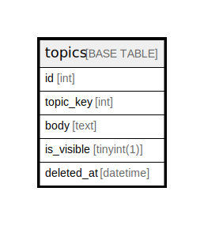

# topics

## Description

<details>
<summary><strong>Table Definition</strong></summary>

```sql
CREATE TABLE `topics` (
  `id` int NOT NULL AUTO_INCREMENT,
  `topic_key` int DEFAULT NULL,
  `body` text,
  `is_visible` tinyint(1) DEFAULT NULL,
  `deleted_at` datetime NOT NULL,
  PRIMARY KEY (`id`),
  UNIQUE KEY `topic_key_idx` (`topic_key`),
  KEY `deleted_at_idx` (`deleted_at`)
) ENGINE=InnoDB DEFAULT CHARSET=utf8mb4 COLLATE=utf8mb4_0900_ai_ci
```

</details>

## Columns

| Name | Type | Default | Nullable | Extra Definition | Children | Parents | Comment |
| ---- | ---- | ------- | -------- | ---------------- | -------- | ------- | ------- |
| id | int |  | false | auto_increment |  |  |  |
| topic_key | int |  | true |  |  |  |  |
| body | text |  | true |  |  |  |  |
| is_visible | tinyint(1) |  | true |  |  |  |  |
| deleted_at | datetime |  | false |  |  |  |  |

## Constraints

| Name | Type | Definition |
| ---- | ---- | ---------- |
| PRIMARY | PRIMARY KEY | PRIMARY KEY (id) |
| topic_key_idx | UNIQUE | UNIQUE KEY topic_key_idx (topic_key) |

## Indexes

| Name | Definition |
| ---- | ---------- |
| deleted_at_idx | KEY deleted_at_idx (deleted_at) USING BTREE |
| PRIMARY | PRIMARY KEY (id) USING BTREE |
| topic_key_idx | UNIQUE KEY topic_key_idx (topic_key) USING BTREE |

## Relations



---

> Generated by [tbls](https://github.com/k1LoW/tbls)
